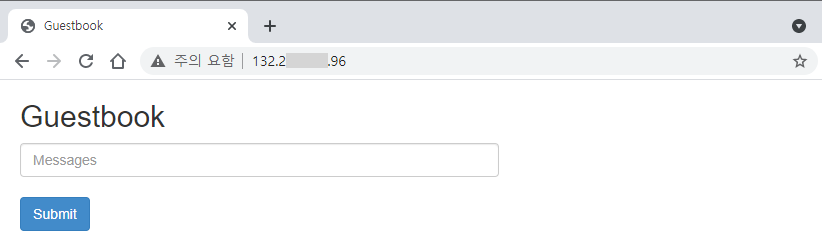

> 참고 자료
> - [K8S Tutorial] [ MongoDB를 사용한 PHP 방명록 애플리케이션 배포하기](https://kubernetes.io/ko/docs/tutorials/stateless-application/guestbook/ "MongoDB를 사용한 PHP 방명록 애플리케이션 배포하기")

### 9) MongoDB를 사용한 PHP 방명록 애플리케이션 배포하기

#### 9-1) Mongo 디플로이먼트를 생성하기

- MongoDB deployment menifest 파일 생성

~~~
$ cat mongo-deployment.yaml
~~~

~~~
apiVersion: apps/v1
kind: Deployment
metadata:
  name: mongo
  labels:
    app: mongo
    tier: backend
spec:
  selector:
    matchLabels:
      app: mongo
      tier: backend
  replicas: 1
  template:
    metadata:
      labels:
        app: mongo
        tier: backend
    spec:
      containers:
      - name: mongo
        image: mongo:4.2
        args:
          - --bind_ip
          - 0.0.0.0
        resources:
          requests:
            cpu: 100m
            memory: 100Mi
        ports:
        - containerPort: 27017
~~~

- MongoDB 배포 및 확인

~~~
$ kubectl apply -f mongo-deployment.yaml
deployment.apps/mongo created
~~~

- MongoDB Pod 확인

~~~
$ kubectl get pods -l app=mongo
NAME                     READY   STATUS              RESTARTS   AGE
mongo-7487b96cf9-v7wcn   0/1     ContainerCreating   0          16s
...
$ kubectl get pods -l app=mongo
NAME                     READY   STATUS    RESTARTS   AGE
mongo-7487b96cf9-v7wcn   1/1     Running   0          67s
~~~

- MongoDB 상세 정보 및 실행 노드 확인

~~~
$ kubectl describe pod mongo
Name:         mongo-7487b96cf9-v7wcn
Namespace:    default
Priority:     0
Node:         10.0.10.155/10.0.10.155
Start Time:   Tue, 04 May 2021 07:33:30 +0000
Labels:       app=mongo
              pod-template-hash=7487b96cf9
              tier=backend
Annotations:  <none>
Status:       Running
IP:           10.244.0.149
IPs:
  IP:           10.244.0.149
Controlled By:  ReplicaSet/mongo-7487b96cf9
Containers:
  mongo:
    Container ID:  docker://1ecbc8c0653...............9d3e1685764
    Image:         mongo:4.2
    Image ID:      docker-pullable://mongo@sha256:81d1b57c9........7601ec1bd9e0fc9
    Port:          27017/TCP
    Host Port:     0/TCP
    Args:
      --bind_ip
      0.0.0.0
    State:          Running
      Started:      Tue, 04 May 2021 07:33:31 +0000
    Ready:          True
    Restart Count:  0
    Requests:
      cpu:        100m
      memory:     100Mi
    Environment:  <none>
    Mounts:
      /var/run/secrets/kubernetes.io/serviceaccount from default-token-x9xxl (ro)
Conditions:
  Type              Status
  Initialized       True
  Ready             True
  ContainersReady   True
  PodScheduled      True
Volumes:
  default-token-x9xxl:
    Type:        Secret (a volume populated by a Secret)
    SecretName:  default-token-x9xxl
    Optional:    false
QoS Class:       Burstable
Node-Selectors:  <none>
Tolerations:     node.kubernetes.io/not-ready:NoExecute op=Exists for 300s
                 node.kubernetes.io/unreachable:NoExecute op=Exists for 300s
Events:          <none>
~~~

- MongDB Pod 로그 확인

~~~
$ kubectl logs -f deployment/mongo
...
2021-05-04T07:38:47.454+0000 I  NETWORK  [listener] connection accepted from 127.0.0.1:51824 #1 (1 connection now open)
2021-05-04T07:38:47.455+0000 I  NETWORK  [conn1] received client metadata from 127.0.0.1:51824 conn1: { application: { name: "MongoDB Shell" }, driver: { name: "MongoDB Internal Client", version: "4.2.13" }, os: { type: "Linux", name: "Ubuntu", architecture: "x86_64", version: "18.04" } }
2021-05-04T07:41:34.853+0000 I  NETWORK  [conn1] end connection 127.0.0.1:51824 (0 connections now open)
~~~

#### 9-2)  MongoDB 접속 및 테스트

- MongoDB Pod 접속 및 테스트

~~~
$ kubectl exec -it mongo-7487b96cf9-v7wcn -- bash
...
root@mongo-7487b96cf9-v7wcn:/# env
...
HOSTNAME=mongo-7487b96cf9-v7wcn
GPG_KEYS=E162F504A20CDF15827F718D4B7C549A058F8B6B
KUBERNETES_PORT_443_TCP_PROTO=tcp
KUBERNETES_PORT_443_TCP_ADDR=10.96.0.1
KUBERNETES_PORT=tcp://10.96.0.1:443
PWD=/
HOME=/root
GOSU_VERSION=1.12
MONGO_VERSION=4.2.13
KUBERNETES_SERVICE_PORT_HTTPS=443
KUBERNETES_PORT_443_TCP_PORT=443
MONGO_REPO=repo.mongodb.org
KUBERNETES_PORT_443_TCP=tcp://10.96.0.1:443
TERM=xterm
MONGO_PACKAGE=mongodb-org
SHLVL=1
MONGO_MAJOR=4.2
KUBERNETES_SERVICE_PORT=443
JSYAML_VERSION=3.13.1
PATH=/usr/local/sbin:/usr/local/bin:/usr/sbin:/usr/bin:/sbin:/bin
KUBERNETES_SERVICE_HOST=10.96.0.1
_=/usr/bin/env
...
root@mongo-7487b96cf9-v7wcn:/# cat /etc/hosts
# Kubernetes-managed hosts file.
127.0.0.1       localhost
::1     localhost ip6-localhost ip6-loopback
fe00::0 ip6-localnet
fe00::0 ip6-mcastprefix
fe00::1 ip6-allnodes
fe00::2 ip6-allrouters
10.244.0.143    mongo-7487b96cf9-v7wcn
...
~~~

- MongoDB 접속 및 테스트

~~~
root@mongo-7487b96cf9-v7wcn:/# mongo
MongoDB shell version v4.2.13
...
MongoDB server version: 4.2.13
Welcome to the MongoDB shell.
...
> show databases
admin   0.000GB
config  0.000GB
local   0.000GB
>
> db;
test
>
> show tables
>
> use admin;
switched to db admin
>
> show tables
system.version
> exit
bye
~~~

- Pod 접속 종료

~~~
root@mongo-7487b96cf9-v7wcn:/# exit
~~~

#### 9-3) MongoDB 서비스 생성

- MongoDB service menifest 파일 생성

~~~
$ cat mongo-service.yaml
~~~

~~~
apiVersion: v1
kind: Service
metadata:
  name: mongo
  labels:
    app: mongo
    tier: backend
spec:
  selector:
    app: mongo
    tier: backend
  type: ClusterIP
  ports:
    - port: 27017
      targetPort: 27017
~~~

- Service 생성

~~~
$ kubectl create -f mongo-service.yaml
service/mongo created
~~~

- Service 확인

~~~
$ kubectl get service -l app=mongo
NAME    TYPE        CLUSTER-IP      EXTERNAL-IP   PORT(S)     AGE
mongo   ClusterIP   10.96.214.141   <none>        27017/TCP   34s
~~~

- Service 상세 확인

~~~
$ kubectl describe service mongo
Name:              mongo
Namespace:         default
Labels:            app=mongo
                   tier=backend
Annotations:       <none>
Selector:          app=mongo,tier=backend
Type:              ClusterIP
IP Families:       <none>
IP:                10.96.214.141
IPs:               <none>
Port:              <unset>  27017/TCP
TargetPort:        27017/TCP
Endpoints:         10.244.0.144:27017
Session Affinity:  None
Events:            <none>
~~~

#### 8-4) Guestbook 배포

- Guestbook menifest 파일 생성

~~~
$ vi guestbook-deployment.yaml
~~~

~~~
apiVersion: apps/v1
kind: Deployment
metadata:
  name: guestbook
  labels:
    app: guestbook
    tier: frontend
spec:
  selector:
    matchLabels:
      app: guestbook
      tier: frontend
  replicas: 3
  template:
    metadata:
      labels:
        app: guestbook
        tier: frontend
    spec:
      containers:
      - name: guestbook
        image: paulczar/gb-frontend:v5
        resources:
          requests:
            cpu: 100m
            memory: 100Mi
        env:
        - name: GET_HOSTS_FROM
          value: dns
        ports:
        - containerPort: 80
~~~

- Guestbook 배포

~~~
$ kubectl create -f guestbook-deployment.yaml
deployment.apps/guestbook created
~~~

- Guestbook 확인

~~~
$ kubectl get pod -l app=guestbook
NAME                        READY   STATUS    RESTARTS   AGE
guestbook-95d666cf8-5lpf5   1/1     Running   0          12s
guestbook-95d666cf8-jbxcz   1/1     Running   0          12s
guestbook-95d666cf8-jztth   1/1     Running   0          13s
~~~

- Guestbook 상세 정보 확인

~~~
$ kubectl describe pod guestbook-95d666cf8-jztth
Name:         guestbook-95d666cf8-jztth
Namespace:    default
Priority:     0
Node:         10.0.10.39/10.0.10.39
Start Time:   Tue, 04 May 2021 14:27:30 +0000
Labels:       app=guestbook
              pod-template-hash=95d666cf8
              tier=frontend
Annotations:  <none>
Status:       Running
IP:           10.244.1.19
IPs:
  IP:           10.244.1.19
...
~~~

~~~
$ kubectl describe pod guestbook-95d666cf8-5lpf5
Name:         guestbook-95d666cf8-5lpf5
Namespace:    default
Priority:     0
Node:         10.0.10.75/10.0.10.75
Start Time:   Tue, 04 May 2021 14:27:30 +0000
Labels:       app=guestbook
              pod-template-hash=95d666cf8
              tier=frontend
Annotations:  <none>
Status:       Running
IP:           10.244.0.18
IPs:
  IP:           10.244.0.18
...
~~~

~~~
$ kubectl describe pod guestbook-95d666cf8-jbxcz
Name:         guestbook-95d666cf8-jbxcz
Namespace:    default
Priority:     0
Node:         10.0.10.155/10.0.10.155
Start Time:   Tue, 04 May 2021 14:27:30 +0000
Labels:       app=guestbook
              pod-template-hash=95d666cf8
              tier=frontend
Annotations:  <none>
Status:       Running
IP:           10.244.0.147
IPs:
  IP:           10.244.0.147
...
~~~

- Guestbook Pod 접속 및 확인

~~~
$ kubectl exec -it guestbook-95d666cf8-jbxcz -- bash
...
root@guestbook-95d666cf8-jbxcz:/var/www/html# env | grep MONGO
MONGO_PORT_27017_TCP=tcp://10.96.214.141:27017
MONGO_SERVICE_HOST=10.96.214.141
MONGO_PORT_27017_TCP_PORT=27017
MONGO_PORT=tcp://10.96.214.141:27017
MONGO_PORT_27017_TCP_PROTO=tcp
MONGO_SERVICE_PORT=27017
MONGO_PORT_27017_TCP_ADDR=10.96.214.141
...
root@guestbook-95d666cf8-jbxcz:/var/www/html# cat guestbook.php
<?php

error_reporting(E_ALL);
ini_set('display_errors', 1);
// echo extension_loaded("mongodb") ? "loaded\n" : "not loaded\n";

if (isset($_GET['cmd']) === true) {
  $host = 'mongo';
  if (getenv('GET_HOSTS_FROM') == 'env') {
    $host = getenv('MONGO_WRITE_HOSTS');
  }
  $mongo_host = "mongodb+srv://$host/guestbook?retryWrites=true&w=majority";
  header('Content-Type: application/json');
  // Create Guestbook Post
  if ($_GET['cmd'] == 'set') {
    $manager = new MongoDB\Driver\Manager("mongodb://$host");
    $bulk = new MongoDB\Driver\BulkWrite(['ordered' => true]);
    $bulk->insert(['message' => $_GET['value']]);
    try {
      $result = $manager->executeBulkWrite('guestbook.messages', $bulk);
    }
    catch (\MongoDB\Driver\Exception\Exception $e) {
      echo '{"error": "An error occured connecting to mongo ' . $host . '"}';
      exit;
    }
    print('{"message": "Updated"}');
  // Get Guestbook Post
  } else {
    $host = 'mongo';
    if (getenv('GET_HOSTS_FROM') == 'env') {
      $host = getenv('MONGO_READ_HOSTS');
    }
    $manager = new MongoDB\Driver\Manager("mongodb://$host");
    $query = new MongoDB\Driver\Query([]);
    try {
      $cursor = $manager->executeQuery('guestbook.messages', $query);
    }
    catch (\MongoDB\Driver\Exception\Exception $e) {
      echo '{"error": "An error occured connecting to mongo ' . $host . '"}';
      exit;
    }
    $data = array();
    foreach ($cursor as $document) {
      $data[] = $document->message;
    }
    print('{"data": ' . json_encode($data) . '}');
  }
} else {
  phpinfo();
} ?>

~~~

#### 8-5) Frontend Service (Load Balancer) 배포

- Frontend Service deployment menifest 파일 생성

~~~
$ cat frontend-service.yaml
~~~

~~~
apiVersion: v1
kind: Service
metadata:
  name: frontend
  labels:
    app: guestbook
    tier: frontend
spec:
  type: LoadBalancer
  ports:
  - port: 80
    protocol: TCP
    targetPort: 80  
  selector:
    app: guestbook
    tier: frontend
~~~

- Frontend Service 배포

~~~
$ kubectl create -f frontend-service.yaml
service/frontend created
~~~

- Frontend Service 배포 확인

~~~
$ kubectl get service
NAME         TYPE           CLUSTER-IP      EXTERNAL-IP   PORT(S)        AGE
frontend     LoadBalancer   10.96.82.77     <pending>     80:32570/TCP   44s
kubernetes   ClusterIP      10.96.0.1       <none>        443/TCP        15d
mongo        ClusterIP      10.96.214.141   <none>        27017/TCP      12h
...
$ kubectl get service
NAME         TYPE           CLUSTER-IP      EXTERNAL-IP      PORT(S)        AGE
frontend     LoadBalancer   10.96.82.77     132.226.226.96   80:32570/TCP   108s
kubernetes   ClusterIP      10.96.0.1       <none>           443/TCP        15d
mongo        ClusterIP      10.96.214.141   <none>           27017/TCP      12h
~~~

- Frontend Service 상세 확인

~~~
$ kubectl describe service frontend
Name:                     frontend
Namespace:                default
Labels:                   app=guestbook
                          tier=frontend
Annotations:              <none>
Selector:                 app=guestbook,tier=frontend
Type:                     LoadBalancer
IP Families:              <none>
IP:                       10.96.82.77
IPs:                      <none>
LoadBalancer Ingress:     132.226.226.96
Port:                     <unset>  80/TCP
TargetPort:               80/TCP
NodePort:                 <unset>  32570/TCP
Endpoints:                10.244.0.147:80,10.244.0.18:80,10.244.1.19:80
Session Affinity:         None
External Traffic Policy:  Cluster
Events:
  Type    Reason                Age    From                Message
  ----    ------                ----   ----                -------
  Normal  EnsuringLoadBalancer  2m49s  service-controller  Ensuring load balancer
  Normal  EnsuredLoadBalancer   107s   service-controller  Ensured load balancer
~~~

- OCI Load Balancer 확인

#### 8-6) Guestbook 테스트

- 홈페이지 접속

- 방명록 입력 및 Submit

- 입력 결과 확인

~~~
$ kubectl create -f frontend-service.yaml
~~~

#### 8-7) MongoDB 입력 내용 확인

- MongoDB 접속 및 내용 확인

~~~
$ kubectl exec -it mongo-7487b96cf9-v7wcn -- bash
root@mongo-7487b96cf9-v7wcn:/#
root@mongo-7487b96cf9-v7wcn:/# mongo
MongoDB shell version v4.2.13
...
> show databases
admin      0.000GB
config     0.000GB
guestbook  0.000GB
local      0.000GB
>
> use guestbook
switched to db guestbook
>
> show tables
messages
>
>  db.messages.find({})
{ "_id" : ObjectId("60921996bc45b46b2f517892"), "message" : ",Queen" }
>
> exit
~~~

